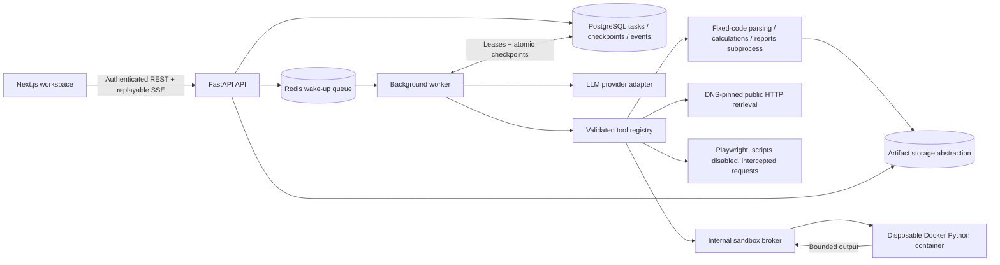

# AutoAgent

A general-purpose agent workspace with observable tool execution, persisted progress, source excerpts, and downloadable artifacts. Next.js/TypeScript frontend; FastAPI/SQLAlchemy backend; PostgreSQL task state; Redis worker notifications; Playwright public-page extraction; Docker-isolated Python.

**Status: PostgreSQL/Docker isolation, shared request limiting, local API failover and browser flows are verified. Live model reliability still needs improvement: the latest research smoke test exhausted its task budget.** Consult `OPERATIONS.md` and `evaluation/security-scaling-tests.xml` for the deployment boundary and test evidence.

## Workspace

Saved tasks support ongoing conversations. Open a task, use **Continue this conversation**, and send a follow-up to revise a report or analyze the same documents again. Previous messages and report downloads stay in that task; active conversations move to the top of history. Wait for the current run or cancel it before sending another message. Each new message gets a fresh execution budget and new Python approvals. Earlier outputs provide bounded model context, while original uploads remain available for reanalysis. Existing demo conversations remain demo conversations.

The redesigned task desk includes a sample CSV loader, searchable history with real file counts, inline Markdown reports and charts, authenticated file previews/downloads, execution and source tabs, and a keyboard-accessible settings dialog. Saved tasks reopen directly from their URL. Mobile uses a navigation drawer; session changes clear stale task state. Automated accessibility checks cover the workspace, report and settings views on desktop and mobile.

For a local production frontend, run `npm run build` then `npm start` from `frontend/`. The launcher copies the public/static assets into the standalone build and binds to loopback. Keep the API and worker running as described below. Use `AUTOAGENT_HOST` only when an alternate bind address is intended.

## Start with Docker Compose

Prerequisites: Docker Engine/Desktop with Linux containers, Docker Compose v2, outbound access to image/package registries. Run from the repository root:

```powershell
if (!(Test-Path .env)) { Copy-Item .env.example .env }
docker compose --profile live up --build -d --scale api=2 --scale worker=2
```

Open <http://localhost:3000>. Compose binds the API and web UI to loopback. The migration service runs before API/worker startup. PostgreSQL and artifact volumes preserve history across restarts. Do not use `docker compose down -v` if you want to keep your data.

Nginx now owns the public ports and balances internal API replicas. See [OPERATIONS.md](OPERATIONS.md) for database location, account request limits, replica sizing and requirements before public deployment.

On PowerShell, use `Copy-Item .env.example .env` instead of `cp` if preferred. Docker Desktop 4.84.0 / Engine 29.6.2 / Compose v5.3.1 fresh build and startup passed on 2026-09-11. Create `.env` only on first setup; preserve existing credentials.

## Local fixture demo without Docker

Prerequisites: Python 3.12, Node.js 22.15+ (Node 24 used for verification), npm. SQLite is a development/test fallback; production configuration stays PostgreSQL.

```sh
python -m venv .venv
.venv/bin/python -m pip install -r backend/requirements.txt
cd frontend
npm ci
npm run dev
```

In two additional terminals, from `backend/`, run:

```sh
../.venv/bin/python -m app.db
../.venv/bin/python -m uvicorn app.main:app --host 127.0.0.1 --port 8000
```

```sh
../.venv/bin/python -m app.worker
```

Windows: replace `.venv/bin/python` with `.venv\Scripts\python.exe` (and the appropriate `..\` prefix). The backend defaults to demo mode, `backend/data/autoagent.db`, and local file storage. A root `.env` created for Compose is not used when launching from `backend/`. Keep API and worker in the same working directory so they share the same fallback database.

The UI runs at <http://127.0.0.1:3000>. All demo research/browser output is conspicuously labeled as a fixture. CSV arithmetic, PDF generation, XLSX generation, uploads, API calls, and event persistence are real. **Fixture mode is a deterministic planner, not a live autonomous agent.** It supports the supplied demo workflows; it does not fulfill arbitrary goals.

## Enable live mode

1. Set `MODE=live`, `LLM_API_KEY`, `LLM_MODEL`, and an OpenAI-compatible `LLM_BASE_URL` in `.env`. The adapter uses Chat Completions with structured function tools. Provider behavior is mocked only in adapter unit tests.
2. Search defaults to Tavily (`SEARCH_PROVIDER=tavily`) with rate-limited free keyless access. Optionally set `TAVILY_API_KEY` for account quota. To use Brave, set `SEARCH_PROVIDER=brave` and `SEARCH_API_KEY`. Search retrieves public pages and retains excerpts; credentials stay server-side. Tavily CLI OAuth is separate from the application's REST integration.
3. Set different random `AUTH_SECRET` and `SANDBOX_SECRET` values of at least 32 characters. Update `TOKEN_PRICE_PER_MILLION` for a conservative estimate for your chosen model. The default is a configurable estimate, not a verified price or invoice.
4. Build the fixed sandbox image and start the live profile:

```sh
docker build -t autoagent-python:local sandbox
docker compose --profile live up --build
```

5. A trusted operator issues a one-hour JWT using `scripts/issue_token.py <subject>` using the root `.env` (explicit environment values take precedence). Paste it into Workspace settings → Live access token. Tokens are held in browser memory only. This is an operator-issued identity boundary, not a public signup/login product. Use an identity provider before any multi-user deployment.

Live mode fails closed when required configuration is missing. Purchases, account actions and outbound messaging are not exposed tools. Generated Python requires approval for the exact code and input IDs. Denying an action prevents resuming it unchanged.

## Architecture



The worker selects one tool per step based on saved observations. Each tool validates a Pydantic schema, executes within a timeout, and returns structured evidence plus artifact metadata. Events contain plans, public action summaries and results, never private chain-of-thought.

| Tool | Inputs | Outputs / limits |
|---|---|---|
| `ingest` | Task-owned file ID | CSV columns/sample, PDF or UTF-8 text; max 100 PDF pages, no OCR, extracted text truncated with flag |
| `analyze_csv` | File ID, category and numeric value columns | Sum by category, excluded row count, lowest 3, SVG and XLSX; max 100k rows / 100 columns / 200 categories |
| `search` | Query | Tavily (default) or Brave results followed by bounded retrieval; source IDs, URLs and excerpts |
| `browse` | Public HTTP(S) URL | Chromium navigation/extraction through pinned retrieval; no scripts, downloads, cookies or account operations |
| `python` | Code, task-owned input IDs | Approved isolated execution; stdout plus bounded PNG/CSV/TXT/JSON files |
| `report` | Findings, hypotheses, known source IDs | Markdown and PDF with vector chart when CSV analysis exists; source excerpts kept separate |
| `finish` | Public summary | Completion after required evidence checks; unresolved last-tool errors prevent success |

“Weakest performing” defaults to **lowest total revenue by category**, with alphabetical tie-breaking. It does not mean least profitable or fastest declining. Negative values are retained. Missing category/non-numeric/non-finite values are excluded and counted. A live model may choose other columns when the user defines another metric. A report distinguishes observations, external excerpts, and hypotheses. Citation traceability is checked; semantic truth of model-written interpretations still needs evaluation.

## Reliability and control

- PostgreSQL is the durable queue and source of truth. Redis is a wake-up hint; a DB scan reconciles missing or duplicate deliveries.
- An atomic lease prevents concurrent workers from committing the same task. A stale worker cannot save results after losing its lease.
- Inputs and pending actions are persisted before dispatch; results, artifact metadata and events commit together. Failed identical actions are limited to two attempts. The next model step can choose a changed action after observing an error.
- Read/derived-output tools can replay after interruption. Uncertain Python execution returns to approval before retrying. This is **not exactly-once execution**. Files written before a failed transaction may remain unreferenced in local storage.
- Cancellation revokes the lease and cancels active async work. Fixed-code parsing/report processes are killed; sandbox broker disconnect handling removes the container. An already-running DNS lookup may finish in its thread.
- Limits cover steps, duration, tool output bytes, token accounting and estimated cost. Provider budget is reserved before dispatch; an interrupted call retains the conservative reservation because actual billing may be unknown. Resume preserves budgets.
- SSE accepts `Last-Event-ID` or `after`, replays stored events, and reconnects. The frontend deduplicates event IDs. History and files survive worker/UI restarts.

## Security boundaries

All task, event, control, upload attachment and download endpoints enforce ownership. UUID storage keys are generated independently of uploaded filenames. Download responses have `nosniff`, restrictive CSP and private cache headers. API ingress rejects unapproved browser origins and oversized bodies.

Public retrieval checks all DNS answers, rejects private/reserved/link-local addresses and credentials/nonstandard ports, pins the connection to the checked address, retains TLS hostname verification, and repeats validation for every redirect. Playwright receives pages through this retrieval layer and aborts non-document requests. Browser JavaScript is deliberately disabled; interactive SPAs are outside this MVP.

Generated code never runs on the application host. The internal broker alone holds the Docker socket. It starts a fixed image without application secrets, mounts or network, with a read-only root, all capabilities dropped, no-new-privileges, 256 MB RAM, one CPU, 48 PIDs, bounded tmpfs mounts and a wall-clock timeout. Broker access is authenticated and is never exposed as a host port. The Docker daemon/broker are trusted infrastructure; use a dedicated or rootless host for deployment, and validate kernel isolation there.

Fixed application parsers/calculations run in cancellable subprocesses. Linux imposes CPU/address-space limits; Windows verification covers timeouts and cancellation but not Linux resource enforcement. UTF-8 input is supported; the PDF's built-in font has limited script coverage. OCR, multilingual font shaping, XLSX uploads and arbitrary binary exports are outside the current implementation.

## Verification and evaluation

From `backend/`:

```sh
../.venv/bin/python -m pytest -q
../.venv/bin/python -m evaluation.run
../.venv/bin/python -m evaluation.run --live
```

From root: `.venv/bin/python -m ruff check backend sandbox`.

From `frontend/`, with API, worker and web running:

```sh
npm run lint
npm run typecheck
npm run build
npx playwright install chromium
npm run test:e2e
```

Container tests: build `autoagent-python:local`, set `AUTOAGENT_CONTAINER_TESTS=1`, then run `pytest tests/test_sandbox.py`. They are skipped unless explicitly enabled, and their skipped status must not be counted as passed isolation evidence.

The 24-case suite and rubric are in `evaluation/cases.json`. Actual run metadata, timings, token/cost accounting and failure categories are in `evaluation/fixture-results.json` and `evaluation/live-results.json`. Fixture scores measure plumbing, arithmetic, file validity and citation traceability, **not live model accuracy or semantic citation support**. A case expecting a controlled failure passes only when it actually fails. Live evaluations use the adapter and need real credentials; they can incur provider charges.

Current results: **39 backend tests passed with no skips against PostgreSQL and the real Docker broker; 8 desktop/mobile E2E tests passed against Compose**. Actual approved NumPy/Matplotlib execution, PNG download, container cancellation, network/filesystem/memory restrictions, and non-root Chromium extraction passed. A worker SIGKILL during a persisted action recovered in 35.609 seconds without duplicate artifacts. The retained 24-case fixture benchmark passed all rubrics (21 task completions and three expected controlled failures; median 2.734 seconds). Live model/search evaluation remains blocked on credentials.

See `DEMO.md` for a recruiter walkthrough, `ACCEPTANCE.md` for check-by-check evidence, and `ISSUES.md` for remaining limitations. Resume templates in `DEMO.md` use measured fixture results or explicit placeholders.

The GitHub Actions workflow at `.github/workflows/verify.yml` runs static checks, the production build, Linux sandbox tests, the fixture benchmark, and end-to-end tests against a fresh Compose stack. It is supplied for reproducible verification; no remote CI run has been claimed. Docker images include the sample assets and a shared Chromium installation accessible to the non-root worker.

## Reproduce Docker integration verification

With the `.env` already configured for demo, run `docker build -t autoagent-python:local sandbox` and `docker compose --profile live up --build -d`. The `live` Compose profile starts the broker; `MODE=demo` still keeps planning and research fixture-backed. Run `npm run test:e2e` from `frontend/`, and `python scripts/verify_docker_recovery.py` from root to exercise actual worker termination/recovery. This recovery check briefly interrupts the worker, so use a development stack.

For the full backend suite, create a dedicated PostgreSQL database named `autoagent_verification_local` using `docker compose exec -T postgres createdb -U autoagent autoagent_verification_local`. Run the sandbox service as a temporary test runner with `AUTOAGENT_TEST_DATABASE_URL` pointing to that database, `AUTOAGENT_CONTAINER_TESTS=1`, `AUTOAGENT_COMPOSE_TESTS=1`, and mount `backend/tests` read-only at `/app/tests`. Run `python -m pytest /app/tests -q -p no:cacheprovider`. The exact portable command is in `.github/workflows/verify.yml`. Tests reset only the explicitly named verification database; they do not reset the application database.

The live evaluator now reads the root `.env`. Fill `LLM_API_KEY` and `LLM_MODEL`, then run `python -m evaluation.run --live` from `backend/`. Tavily search works keyless within its rate limits; optionally configure `TAVILY_API_KEY`. This uses real services and can incur provider charges. Authentication and broker secrets have been generated locally, not published.
