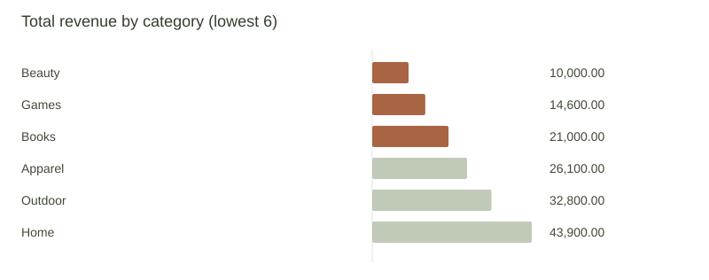

# Sales category analysis

DEMO · fixture-backed workflow

## Findings
sales.csv: Weakest categories by sum of revenue: Beauty (10,000.00), Games (14,600.00), Books (21,000.00)

## Hypotheses and suggested experiments
Experiment ideas, not established causes: test category positioning and compare conversion against a control; evaluate sample size and margins before changing spend.

## Calculation method
Ascending sum of revenue by category; ties alphabetical. Negative values retained. Not profit or growth. Excluded rows: 0. Input file: 8ba94995-eb49-4d80-86e7-f4035b48ad44.

## External source excerpts

[fixture-market] Sample market context · DEMO FIXTURE
https://example.com

> Fictional sample: category demand may differ by season. This is not evidence about any real market.
